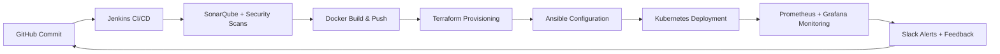

Here’s a **ready-to-copy professional README.md** for your GitHub repository:

---

# 🛠️ Real-Time Food E-Commerce Platform (Swiggy Clone) – DevOps Automation Pipeline

## 🚀 Overview

This repository contains the complete implementation of a **fully automated DevOps CI/CD pipeline** for a real-time food-ordering platform inspired by **Swiggy**.
The project demonstrates **end-to-end automation** — from code commit to deployment — using modern DevOps tools and AWS cloud infrastructure.

---

## 🎯 Objectives

* Automate build, testing, and deployment of the Swiggy-clone application.
* Ensure zero downtime with containerized deployments on Kubernetes.
* Maintain security and quality with integrated DevSecOps practices.
* Enable auto-scaling and real-time monitoring on AWS Cloud.
* Leverage Infrastructure as Code (Terraform) and Configuration as Code (Ansible).

---

## ⚙️ Tech Stack

**Frontend:** ReactJS, HTML, CSS, JavaScript, Bootstrap
**Backend:** Node.js, Express.js, REST APIs, MongoDB/DynamoDB
**DevOps Tools:** Jenkins, Docker, Kubernetes, Terraform, Ansible
**Security & Quality:** SonarQube, OWASP Dependency Check, Trivy
**Monitoring & Alerts:** Prometheus, Grafana, Slack
**Cloud:** AWS EC2, EKS, S3, IAM, CloudWatch

---

## 🧱 Architecture Flow



---

## 🔄 CI/CD Pipeline Overview

| Stage                       | Tool(s)                    | Description                                                                        |
| --------------------------- | -------------------------- | ---------------------------------------------------------------------------------- |
| **Code Commit**             | GitHub                     | Stores app and infrastructure code (React, Node, Terraform, Ansible, Jenkinsfile). |
| **Build & Integration**     | Jenkins                    | Triggers automatically, executes all pipeline stages.                              |
| **Code Quality & Security** | SonarQube, OWASP, Trivy    | Runs static analysis and vulnerability scans.                                      |
| **Containerization**        | Docker, DockerHub          | Builds and stores application images.                                              |
| **Infrastructure as Code**  | Terraform                  | Provisions AWS EC2, Security Groups, and networking.                               |
| **Configuration as Code**   | Ansible                    | Configures instances and installs dependencies.                                    |
| **Deployment**              | Kubernetes                 | Deploys Docker containers, enables autoscaling and load balancing.                 |
| **Monitoring**              | Prometheus, Grafana, Slack | Tracks performance and sends real-time alerts.                                     |
| **Feedback Loop**           | GitHub + Jenkins           | Issues trigger new commits, restarting the CI/CD process.                          |

---

## 📂 Repository Structure

```
├── frontend/                  # ReactJS frontend
├── backend/                   # Node.js backend
├── Dockerfile                 # Docker build config
├── Jenkinsfile                # Jenkins pipeline definition
├── terraform/                 # Terraform IaC scripts
│   ├── main.tf
│   ├── variables.tf
│   └── outputs.tf
├── ansible/                   # Ansible playbooks
│   ├── install_docker.yml
│   ├── setup_jenkins.yml
│   └── deploy_app.yml
├── k8s/                       # Kubernetes manifests
│   ├── deployment.yaml
│   └── service.yaml
├── monitoring/                # Prometheus & Grafana configs
│   ├── prometheus.yml
│   └── grafana_dashboard.json
└── README.md
```

---

## ⚡ Deployment Steps

### 1️⃣ Clone Repository

```bash
git clone https://github.com/<your-username>/swiggy-devops-pipeline.git
cd swiggy-devops-pipeline
```

### 2️⃣ Provision Infrastructure (Terraform)

```bash
cd terraform
terraform init
terraform plan
terraform apply -auto-approve
```

### 3️⃣ Configure Server (Ansible)

```bash
cd ../ansible
ansible-playbook -i inventory.ini setup_jenkins.yml
ansible-playbook -i inventory.ini install_docker.yml
```

### 4️⃣ Trigger Jenkins Pipeline

* Access Jenkins: `http://<EC2-Public-IP>:8080`
* Configure credentials (GitHub, DockerHub, AWS)
* Run pipeline defined in `Jenkinsfile`

### 5️⃣ Deploy on Kubernetes

```bash
cd ../k8s
kubectl apply -f deployment.yaml
kubectl apply -f service.yaml
```

### 6️⃣ Access Application

```
http://<LoadBalancer-DNS>:3000
```

### 7️⃣ Monitor & Alerts

* Prometheus: `http://<EC2-IP>:9090`
* Grafana: `http://<EC2-IP>:3000`
* Slack: real-time alerts from Prometheus

---

## 🧠 Key Learnings

* Fully automated DevOps lifecycle from code commit to production.
* Consistent infrastructure provisioning with Terraform & Ansible.
* DevSecOps pipeline integrating SonarQube and vulnerability scans.
* Kubernetes-managed deployments achieving zero downtime.
* Continuous monitoring and real-time feedback improving reliability.

---

## 🔮 Future Enhancements

* Implement **blue-green** or **canary deployments** for safer rollouts.
* Use **HashiCorp Vault** for secrets management.
* Integrate **ELK Stack (Elasticsearch, Logstash, Kibana)** for centralized logging.
* Expand cluster to **multi-region AWS** deployments.

---

## 👥 Contributors

* **Yash Srivastava** – Application Development & DevOps Integration
* **Nikhil Sharma** – Infrastructure Automation & Monitoring Setup
* **Yash Srivastava** – Security and CI/CD Integration
* **Faculty Guide:** Dr. V. Deeban Chakravarthy V, Associate Professor, Dept. of Computing Technologies

---

## 🧾 License

Academic Project © 2025 — SRM Institute of Science and Technology
All rights reserved.

---

Would you like me to include **badges** (like build status, Docker pulls, AWS, and license) at the top of this README to make it look more professional on GitHub?
